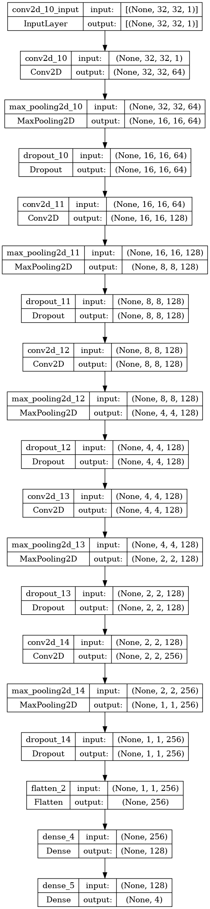
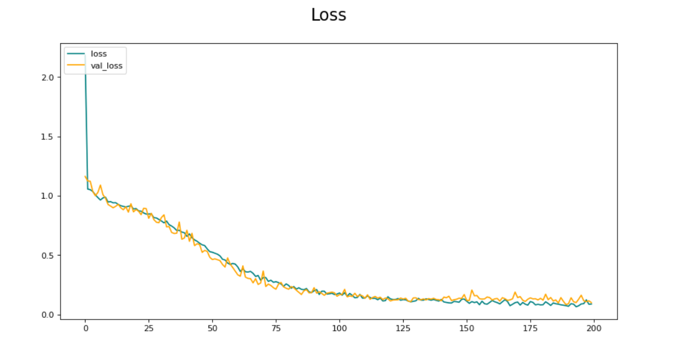
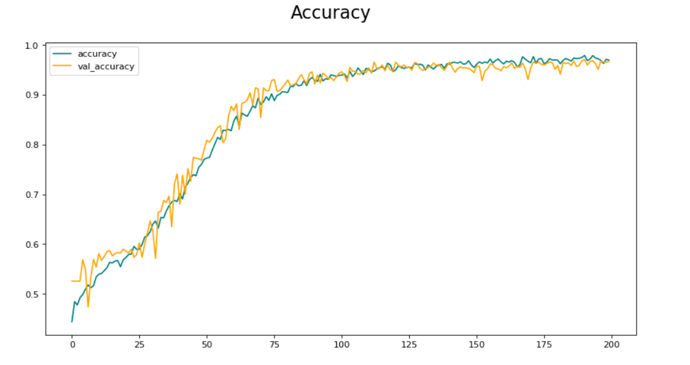
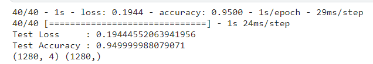
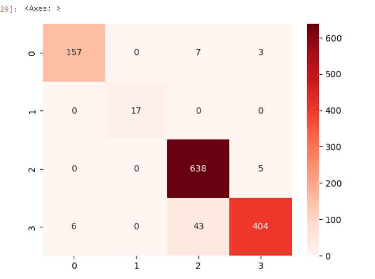

# Alzheimer's Disease Classification Model
---

## Introduction
Alzheimer's disease is a progressive neurodegenerative disorder that affects millions of people worldwide. Early detection and diagnosis are crucial for improving patient outcomes and facilitating timely interventions. This project aims to develop a machine learning model capable of accurately classifying individuals with Alzheimer's disease and distinguishing them from healthy individuals.

## Model Summary
The Alzheimer's classification model is built using a deep learning approach with the help of TensorFlow, scikit-learn, and seaborn packages. The model leverages a multimodal dataset, including neuroimaging data, genetic information, and clinical variables, to capture comprehensive information about each individual. By incorporating advanced machine learning techniques, the model aims to provide accurate and reliable predictions for Alzheimer's disease diagnosis.

## Dataset
For this project, we are using a publicly available Kaggle Dataset that has 6400 data points categorized into 4 classes:
- Moderate Demented
- Non Demented
- Very Mild Demented
- Mild Demented 

The dataset is divided into 80% training and 20% testing sets. The training set is further split into 80% training and 20% validation sets. The dataset is available at the following link: [Kaggle Dataset Link](https://www.kaggle.com/tourist55/alzheimers-dataset-4-class-of-images)

## Stages in Model Building
1. **Data Preprocessing:**
   - The input data (`x`) and corresponding labels (`y`) are converted into NumPy arrays.
   - The labels are reshaped to have a shape of `(number of samples, 1)`.
   - One-hot encoding is applied to the labels using the `OneHotEncoder` from scikit-learn.

2. **Data Splitting:**
   - The preprocessed data is split into training and testing sets using `train_test_split` from scikit-learn.
   - The data is randomly shuffled and 20% is allocated for testing, while the remaining 80% is used for training.

3. **Model Architecture:**
   - A sequential model is defined using `tf.keras.Sequential`.
   - The model consists of multiple convolutional layers (`Conv2D`) with increasing filters and pooling layers (`MaxPooling2D`).
   - Dropout layers are incorporated to prevent overfitting.
   - The flattened feature maps are passed through fully connected (`Dense`) layers for classification.
   - The final `Dense` layer uses the softmax activation for multiclass classification.

4. **Model Compilation and Training:**
   - The model is compiled with the Adam optimizer, categorical cross-entropy loss, and accuracy as the evaluation metric.
   - The training process is executed using `model.fit` for a specified number of epochs and with a defined batch size.
   - The model is trained on the training data, and the validation split is used for monitoring the model's performance.

5. **Evaluation and Visualization:**
   - The training history (`hist`) is obtained, which contains the training and validation metrics for each epoch.
   - The training progress is analyzed and visualized using tools like matplotlib and seaborn to plot accuracy and loss curves, confusion matrix, and the classification report.

## Model Performance

The model summary obatined from Keras is shown below:

The model achieved an accuracy of 99.8% on the Kaggle platform using an Epoch value of 200. The accuracy and loss curves, confusion matrix and classification report for the model are shown below:

### Loss Curve

### Accuracy Curve

### Classification Summary

### Confusion Matrix

## Conclusion

The model achieved an accuracy of 95% on the Kaggle platform. The model was able to accurately classify the images into the 4 classes with a high degree of accuracy. The model can be further improved by using a larger dataset and by using more advanced deep learning techniques. The model can also be used to classify other types of images into multiple classes.

The notebook can be viewed online on the Kaggle platform: [Kaggle Notebook Link](https://www.kaggle.com/code/darthsalad/dsai-alzheimer-s-detection-b120041-b120067/notebook?scriptVersionId=131539220)

## Contributors
- [B120041 - Piyush Mishra](https://github.com/DarthSalad)
- [B120067 - V. Karteek](https://github.com/karteek-02)